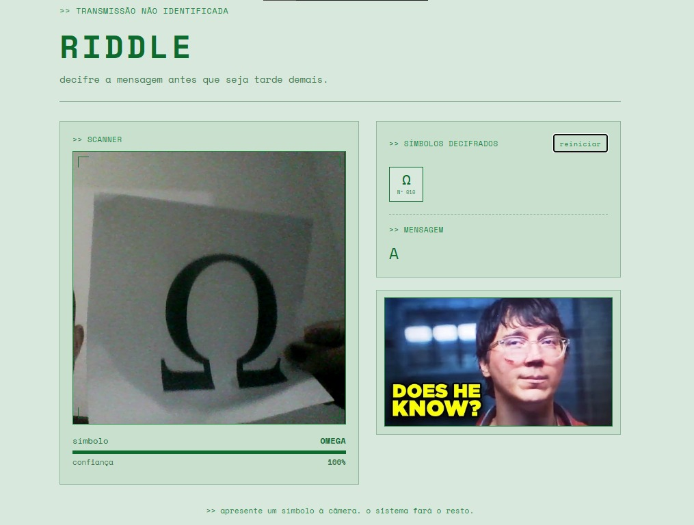

# RIDDLE — Decifrador de uma Escrita Desconhecida

> Sistema de reconhecimento e decifração de símbolos via webcam, usando um
> modelo treinado no Teachable Machine e integrado a uma aplicação
> React + TypeScript com TensorFlow.js.

**Autor:** Lucas da Silva Santos

## O que é

A aplicação recebe, ao vivo pela webcam, cartões desenhados com símbolos de
um alfabeto fictício (inspirado em letras gregas, runas, símbolos
alquímicos e astronômicos/matemáticos), com uma estética visual de
investigação e mensagem cifrada. Cada símbolo reconhecido com confiança
suficiente é automaticamente registrado na ficha de símbolos decifrados e
traduzido para uma letra, formando uma mensagem decodificada em tempo real.

A ação disparada pela predição do modelo é: **registrar o símbolo na ficha
e atualizar a mensagem decodificada** — sem qualquer clique manual do
usuário.

## Demonstração




## Alfabeto

| Glifo | Classe treinada | Significado |
|---|---|---|
| Ω | OMEGA | A |
| ᚱ | RUNA | E |
| ☉ | SOL | I |
| Δ | DELTA | O |
| ∞ | INFINITO | U |
| ☾ | LUA | (espaço) |
| 🜏 | ENXOFRE | S |
| ⌖ | MIRA | R |
| ⏚ | TERRA | N |
| ⚶ | VESTA | T |
| ⌘ | NO | M |
| (tridente) | CUNHA | D |
| — | NEUTRO | (ignorado — fundo/nada) |

Letras disponíveis: **A E I O U S R N T M D** + espaço. O alfabeto não
contém Q, C, H, B, F, G, J, K, L, P, V, X, Z, W, Y nem acentos.

*(Esta tabela está definida em `src/data/alphabet.ts` — os nomes de classe
precisam bater exatamente com os nomes usados no Teachable Machine.)*

## Rodando localmente

### 1. Pré-requisitos
- Node.js 18+
- Webcam

### 2. Modelo já treinado (incluído no repositório)

O modelo já vem treinado e exportado dentro de `public/model/`
(`model.json`, `weights.bin`, `metadata.json`) — não é necessário treinar
nada para rodar o projeto localmente.

Caso queira retreinar ou entender como o modelo foi construído:

1. Acesse [teachablemachine.withgoogle.com](https://teachablemachine.withgoogle.com/train/image)
2. Crie um projeto de classificação de imagem
3. Crie uma classe para cada símbolo do alfabeto (nomeie exatamente como em
   `src/data/alphabet.ts`: `OMEGA`, `RUNA`, `SOL`, `DELTA`, `INFINITO`,
   `LUA`, `ENXOFRE`, `MIRA`, `TERRA`, `VESTA`, `NO`, `CUNHA`) + uma classe
   `NEUTRO`
4. Colete imagens de cada símbolo variando ângulo, distância, iluminação
   e fundo (foram usadas ~340–350 imagens por símbolo e ~500 imagens para
   a classe `NEUTRO`, cobrindo fundo vazio, mãos sem cartão e diferentes
   ambientes, para reduzir falsos positivos)
5. Treine o modelo
6. Exporte em formato **TensorFlow.js**
7. Substitua os arquivos `model.json`, `weights.bin` e `metadata.json` em
   `public/model/` pelos novos gerados


### 3. Instalar e rodar
```bash
npm install
npm run dev
```
Acesse `http://localhost:5173`, permita o acesso à câmera e apresente os
cartões.

### 4. Build de produção
```bash
npm run build
npm run preview
```

## Estrutura do projeto

```
src/
  types/glyph.ts          # tipos + limiar de confiança + janela de estabilidade
  data/alphabet.ts         # mapeamento símbolo → significado (a "cifra")
  services/classifierService.ts  # carrega o modelo TF.js e roda inferência
  hooks/useClassifierLoop.ts     # loop de câmera + lógica de estabilidade/disparo
  components/ScanPane.tsx  # feed de câmera + leitura de confiança
  components/Ledger.tsx    # ficha de símbolos decifrados + mensagem
  App.tsx                  # composição da tela
public/model/               # coloque aqui os arquivos exportados do Teachable Machine
public/doesheknow.jpg       # imagem de referência usada na interface
```

## Detalhes técnicos relevantes

- **Limiar de confiança:** só uma predição acima de 80% é considerada
  (`CONFIDENCE_THRESHOLD` em `types/glyph.ts`), evitando ruído.
- **Janela de estabilidade:** o mesmo símbolo precisa ficar acima do limiar
  por ~900ms contínuos antes de ser registrado, evitando duplicação por
  frames instáveis (`STABILITY_WINDOW_MS`).
- **Separação ML / regra de negócio:** o modelo só devolve o nome da classe
  reconhecida (ex: `"OMEGA"`) — quem decide que isso significa a letra "A"
  é o dicionário em `data/alphabet.ts`, mantendo a lógica de decifração
  totalmente fora do modelo treinado.
- **Classe NEUTRO:** treinada com um volume maior de imagens (~500) que os
  demais símbolos, cobrindo múltiplos ambientes de fundo, justamente para
  reduzir o risco de o modelo confundir fundo vazio com algum símbolo.
